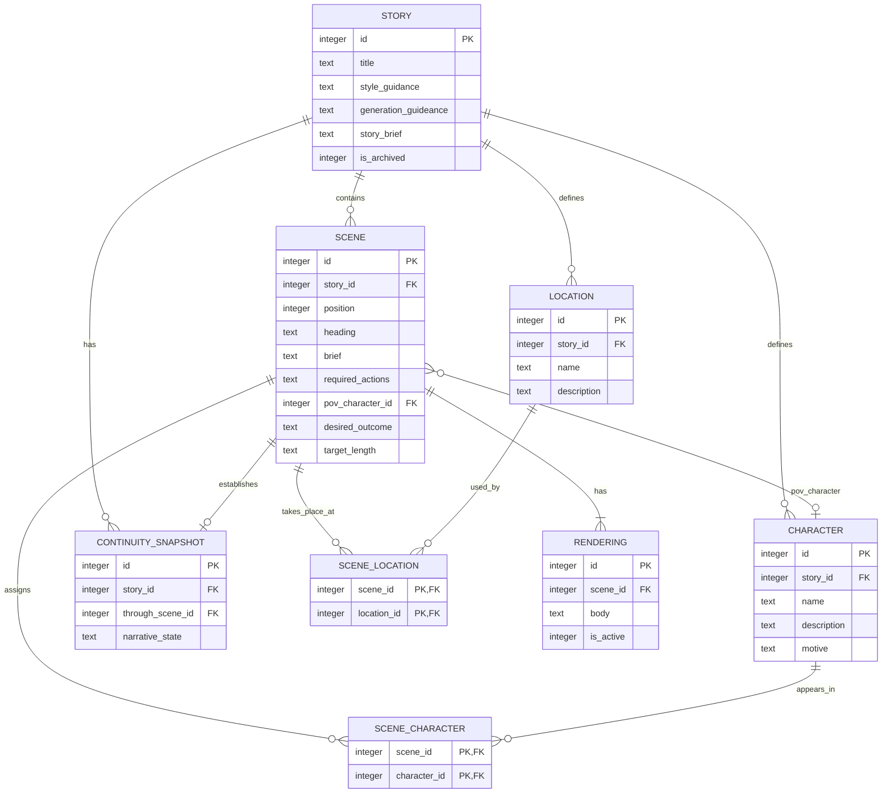

# Scene Writer data model

## Purpose

Scene Writer persists its working data in a local SQLite database. This document is
the source of truth for the relational model; it describes the schema but does not
create a database.

The model begins with a **story**: the container for all creative direction and
eventual scenes that make up one narrative work. A story supplies shared context for
each scene-construction and scene-drafting run.

## Design principles

- Keep human-authored, story-wide direction in relational columns so it is easy to
  inspect and edit.
- Preserve generated material separately from the instructions that produced it. This
  lets an agent revise a draft without overwriting a story's source direction.
- Store ordered content explicitly. Scenes belong to a story and have a stable
  position within it.
- Keep enduring character and location reference details separate from mutable,
  scene-to-scene continuity state.
- Use SQLite-friendly types: `INTEGER` for identifiers, counts, flags, and ordering;
  `TEXT` for prose and constrained values.

## Entity relationship overview



## Story

Each row represents one independently writable narrative work. A story is the root
object for future scenes, scene-construction records, generated drafts, and other
supporting data.

| Column | SQLite type | Required | Description |
| --- | --- | --- | --- |
| `id` | `INTEGER` | Yes | SQLite-generated, auto-incrementing primary key. |
| `title` | `TEXT` | Yes | Human-readable working title. Unique titles are not required. |
| `style_guidance` | `TEXT` | No | Overall writing style: voice, tense, point of view, tone, pacing, and comparable creative direction. |
| `generation_guideance` | `TEXT` | No | Per-story instructions for generation beyond style, such as content boundaries, recurring prose rules, or other author constraints. |
| `story_brief` | `TEXT` | Yes | Overall situation, premise, and expected major events for the story. |
| `is_archived` | `INTEGER` | Yes | `1` when the story is archived; otherwise `0`. |

### Constraints and indexes

- `id` is an auto-incrementing SQLite primary key.
- `title` must be non-empty after trimming whitespace.
- `story_brief` must be non-empty after trimming whitespace.
- `is_archived` is limited to `0` (not archived) or `1` (archived).
- Index stories by `is_archived` to support the main library views.

### SQLite definition

```sql
CREATE TABLE story (
    id INTEGER PRIMARY KEY AUTOINCREMENT,
    title TEXT NOT NULL CHECK (length(trim(title)) > 0),
    style_guidance TEXT,
    generation_guideance TEXT,
    story_brief TEXT NOT NULL CHECK (length(trim(story_brief)) > 0),
    is_archived INTEGER NOT NULL DEFAULT 0 CHECK (is_archived IN (0, 1))
);

CREATE INDEX idx_story_is_archived
    ON story (is_archived);
```

## Scene

Scenes are ordered units within a story. A heading is optional text that can label or
frame a scene without becoming part of its prose rendering.

| Column | SQLite type | Required | Description |
| --- | --- | --- | --- |
| `id` | `INTEGER` | Yes | SQLite-generated, auto-incrementing primary key. |
| `story_id` | `INTEGER` | Yes | The owning story's `id`. |
| `position` | `INTEGER` | Yes | The scene's display and narrative order within its story. |
| `heading` | `TEXT` | No | Optional scene heading text. |
| `brief` | `TEXT` | Yes | Free-form author brief for the scene. |
| `required_actions` | `TEXT` | No | Actions or events the scene generator must include when present. |
| `pov_character_id` | `INTEGER` | No | Character whose point of view governs the scene. It must belong to the same story as the scene. |
| `desired_outcome` | `TEXT` | No | Desired state, decision, revelation, complication, or other change by the end of the scene. |
| `target_length` | `TEXT` | No | Optional guidance for expected prose length, such as a target character count or `short`. |

Each scene position must be non-negative and unique within its story. `brief` must be
non-empty after trimming whitespace. When present, `required_actions`,
`desired_outcome`, and `target_length` are supplied to the scene generator as part of
the scene brief. The `pov_character_id` may be supplied as the point-of-view instruction.

```sql
CREATE TABLE scene (
    id INTEGER PRIMARY KEY AUTOINCREMENT,
    story_id INTEGER NOT NULL REFERENCES story(id) ON DELETE CASCADE,
    position INTEGER NOT NULL CHECK (position >= 0),
    heading TEXT,
    brief TEXT NOT NULL CHECK (length(trim(brief)) > 0),
    required_actions TEXT,
    pov_character_id INTEGER REFERENCES character(id) ON DELETE SET NULL,
    desired_outcome TEXT,
    target_length TEXT,
    UNIQUE (story_id, position)
);

CREATE INDEX idx_scene_story_id_position
    ON scene (story_id, position);

CREATE INDEX idx_scene_pov_character_id
    ON scene (pov_character_id);
```

The data layer must ensure that a scene's `pov_character_id`, when present, belongs to
the same story as the scene. SQLite cannot enforce that rule with these two foreign
keys alone; enforce it in application logic or use a composite story-aware foreign-key
design.

## Character

Characters belong to exactly one story. This keeps each story's cast independent, even
when two stories use the same character name. A character may be assigned to any number
of scenes in its own story; a scene may have no character assignments.

| Column | SQLite type | Required | Description |
| --- | --- | --- | --- |
| `id` | `INTEGER` | Yes | SQLite-generated, auto-incrementing primary key. |
| `story_id` | `INTEGER` | Yes | The owning story's `id`. |
| `name` | `TEXT` | Yes | The character's display name within the story. |
| `description` | `TEXT` | No | Free-form physical characteristics and other enduring character details. |
| `motive` | `TEXT` | No | Free-form description of what drives the character. |

Character names must be unique within a story after trimming whitespace. They are not
globally unique.

```sql
CREATE TABLE character (
    id INTEGER PRIMARY KEY AUTOINCREMENT,
    story_id INTEGER NOT NULL REFERENCES story(id) ON DELETE CASCADE,
    name TEXT NOT NULL CHECK (length(trim(name)) > 0),
    description TEXT,
    motive TEXT,
    UNIQUE (story_id, name)
);

CREATE INDEX idx_character_story_id
    ON character (story_id);
```

## Location

Locations belong to exactly one story, giving every story its own reusable set of
settings. Each location has a name and general description. A location may be assigned
to any number of scenes in its own story; a scene may have no location assignments.

| Column | SQLite type | Required | Description |
| --- | --- | --- | --- |
| `id` | `INTEGER` | Yes | SQLite-generated, auto-incrementing primary key. |
| `story_id` | `INTEGER` | Yes | The owning story's `id`. |
| `name` | `TEXT` | Yes | The location's display name within the story. |
| `description` | `TEXT` | No | General description of the location. |

Location names must be unique within a story, after trimming whitespace. They are not
globally unique.

```sql
CREATE TABLE location (
    id INTEGER PRIMARY KEY AUTOINCREMENT,
    story_id INTEGER NOT NULL REFERENCES story(id) ON DELETE CASCADE,
    name TEXT NOT NULL CHECK (length(trim(name)) > 0),
    description TEXT,
    UNIQUE (story_id, name)
);

CREATE INDEX idx_location_story_id
    ON location (story_id);
```

## Scene cast assignment

`scene_character` is the join table between scenes and characters. It has no required
attributes beyond its two identifiers. Its composite primary key prevents assigning the
same character to a scene more than once.

```sql
CREATE TABLE scene_character (
    scene_id INTEGER NOT NULL REFERENCES scene(id) ON DELETE CASCADE,
    character_id INTEGER NOT NULL REFERENCES character(id) ON DELETE CASCADE,
    PRIMARY KEY (scene_id, character_id)
);

CREATE INDEX idx_scene_character_character_id
    ON scene_character (character_id);
```

The data layer must ensure that a scene and every assigned character belong to the same
story. SQLite cannot enforce that rule with these two foreign keys alone; enforce it in
application logic or use a composite story-aware foreign-key design.

## Scene location assignment

`scene_location` is the join table between scenes and locations. It allows a scene to
have zero or more locations and a location to be reused by any number of scenes. Its
composite primary key prevents duplicate assignments.

```sql
CREATE TABLE scene_location (
    scene_id INTEGER NOT NULL REFERENCES scene(id) ON DELETE CASCADE,
    location_id INTEGER NOT NULL REFERENCES location(id) ON DELETE CASCADE,
    PRIMARY KEY (scene_id, location_id)
);

CREATE INDEX idx_scene_location_location_id
    ON scene_location (location_id);
```

As with scene cast assignments, the data layer must ensure that a scene and every
assigned location belong to the same story. This can be enforced in application logic
or through a composite story-aware foreign-key design.

## Rendering

Each scene may have zero or more renderings: generated or edited versions of that
scene's prose. A rendering belongs to one scene and contains its complete text body.
The active rendering is the selected version the application should use when presenting
the scene or building continuity context for later scenes.

| Column | SQLite type | Required | Description |
| --- | --- | --- | --- |
| `id` | `INTEGER` | Yes | SQLite-generated, auto-incrementing primary key. |
| `scene_id` | `INTEGER` | Yes | The owning scene's `id`. |
| `body` | `TEXT` | Yes | Full rendered prose for the scene. |
| `body_reasoning` | `TEXT` | No | The model's reasoning/thinking output while generating `body`, if the model used supports and returned one. |
| `is_active` | `INTEGER` | Yes | `1` when this is the scene's active rendering; otherwise `0`. |

```sql
CREATE TABLE rendering (
    id INTEGER PRIMARY KEY AUTOINCREMENT,
    scene_id INTEGER NOT NULL REFERENCES scene(id) ON DELETE CASCADE,
    body TEXT NOT NULL,
    body_reasoning TEXT,
    is_active INTEGER NOT NULL DEFAULT 0 CHECK (is_active IN (0, 1))
);

CREATE INDEX idx_rendering_scene_id
    ON rendering (scene_id);

CREATE UNIQUE INDEX idx_rendering_one_active_per_scene
    ON rendering (scene_id)
    WHERE is_active = 1;
```

The partial unique index guarantees that a scene has **at most one** active rendering.
A scene may initially have no renderings, and it may have renderings with none selected
as active. This supports persisting the complete story model before generation,
producing several versions of a scene, selecting one to keep, and then using that active
rendering as continuity context when rendering the next scene in sequence.

## Continuity snapshot

A continuity snapshot is a compact narrative-state checkpoint generated after an
accepted scene. It records only the information needed to write the following scene:
for example, current locations, changed knowledge, injuries, possessions, relationship
changes, and unresolved threads. It is not a replacement for the full scene rendering
or for human-authored story, character, and location reference information.

`narrative_state` is deliberately a single `TEXT` field. It should contain concise,
structured-for-reading prose or bullets rather than a required JSON schema, so it can be
produced and consumed efficiently by smaller self-hosted models.

| Column | SQLite type | Required | Description |
| --- | --- | --- | --- |
| `id` | `INTEGER` | Yes | SQLite-generated, auto-incrementing primary key. |
| `story_id` | `INTEGER` | Yes | The story whose current narrative state is represented. |
| `through_scene_id` | `INTEGER` | Yes | The last scene whose accepted active rendering is reflected by this snapshot. |
| `narrative_state` | `TEXT` | Yes | Compact text state used as continuity context for the next scene. |
| `narrative_state_reasoning` | `TEXT` | No | The model's reasoning/thinking output while generating `narrative_state`, if the model used supports and returned one. |

There is at most one snapshot for a given story and `through_scene_id`. When the active
rendering for that scene changes, the application must delete or replace its snapshot
and regenerate snapshots for all later scenes in the story before using them as
continuity context. The data layer must ensure that `through_scene_id` belongs to
`story_id`.

```sql
CREATE TABLE continuity_snapshot (
    id INTEGER PRIMARY KEY AUTOINCREMENT,
    story_id INTEGER NOT NULL REFERENCES story(id) ON DELETE CASCADE,
    through_scene_id INTEGER NOT NULL REFERENCES scene(id) ON DELETE CASCADE,
    narrative_state TEXT NOT NULL CHECK (length(trim(narrative_state)) > 0),
    narrative_state_reasoning TEXT,
    UNIQUE (story_id, through_scene_id)
);

CREATE INDEX idx_continuity_snapshot_story_scene
    ON continuity_snapshot (story_id, through_scene_id);
```

## Prompt-building implications

When constructing a scene-generation prompt, use:

- `story.story_brief` for the premise and major direction.
- `story.style_guidance` for voice, tense, tone, and pacing.
- `story.generation_guideance` for additional per-story generation constraints.
- `scene.brief`, `required_actions`, `desired_outcome`, and `target_length` for the
  current scene's request.
- `scene.pov_character_id` to select the relevant character reference card and set the
  point-of-view instruction.
- Assigned `scene_character` and `scene_location` records for the scene's relevant
  reference context.
- The snapshot through the immediately preceding scene for compact, mutable continuity
  context.

Use the active `rendering` only as generated prose context. Do not overwrite the
human-authored story or scene fields with generated prose.

## Amendments

### 2026-08-29 — Capture model reasoning on rendering and continuity snapshot

Added `rendering.body_reasoning` and `continuity_snapshot.narrative_state_reasoning`,
both nullable `TEXT` columns. Some models used for scene rendering and
continuity-snapshot generation return a reasoning/thinking trace alongside their
final answer; these columns persist that trace so it can be reviewed after
generation completes, rather than being discarded once the live stream ends. Both
columns are optional because many models — including the smaller self-hosted
models this project targets for continuity-snapshot generation — do not return a
reasoning output at all; callers store `NULL` in that case rather than an empty
string.
