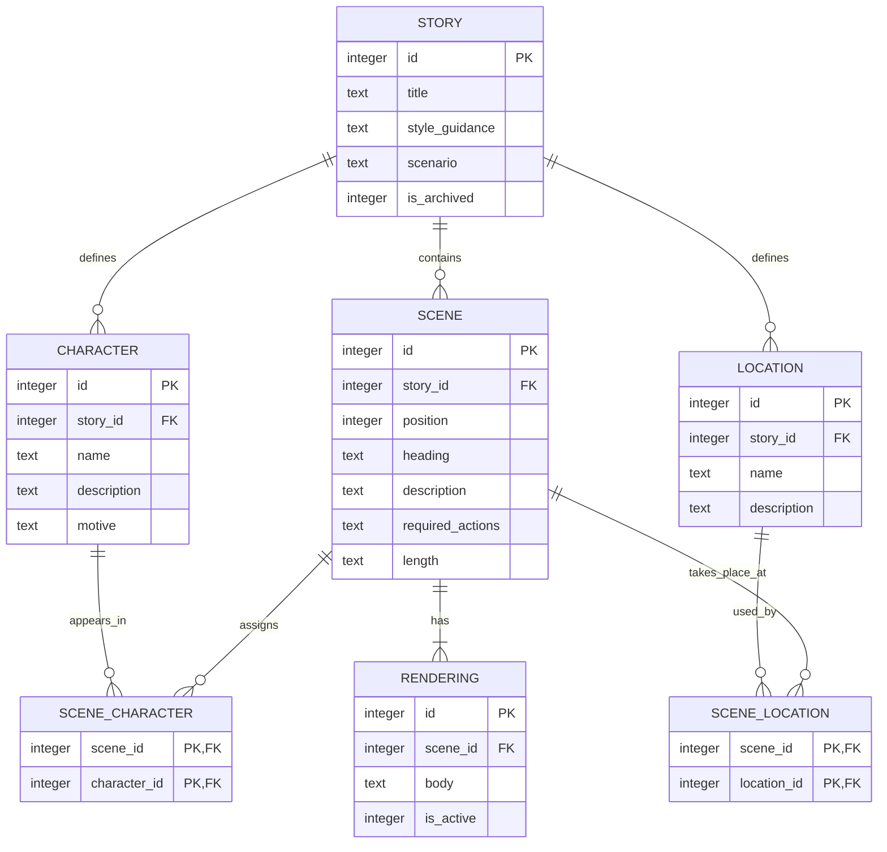

# Scene Writer data model

## Purpose

Scene Writer persists its working data in a local SQLite database. This document is the
source of truth for the proposed relational model; it describes the schema but does not
create a database.

The model begins with a **story**: the container for all of the creative direction and
eventual scenes that make up one narrative work. A story supplies the shared context that
each scene-construction and scene-drafting run needs.

## Design principles

- Keep human-authored, story-wide direction in relational columns so it is easy to inspect
  and edit.
- Preserve generated material separately from the instructions that produced it. This lets
  an agent revise a draft without overwriting a story's source direction.
- Store ordered content explicitly. Future scenes will belong to a story and have a stable
  position within it.
- Use SQLite-friendly types: `INTEGER` for identifiers, counts, flags, and ordering; `TEXT`
  for prose and constrained values.

## Entity relationship overview



`SCENE` is specified here only to the extent needed to establish its relationships,
renderings, and optional heading. Its construction-specific fields will be defined in a later
iteration.

## Story

Each row represents one independently writable narrative work. A story is the root object
for future scenes, scene-construction records, generated drafts, and other supporting data.

| Column | SQLite type | Required | Description |
| --- | --- | --- | --- |
| `id` | `INTEGER` | Yes | SQLite-generated, auto-incrementing primary key. |
| `title` | `TEXT` | Yes | Human-readable working title. Unique titles are not required. |
| `style_guidance` | `TEXT` | No | Overall writing style: voice, tense, point of view, tone, pacing, and comparable creative direction. |
| `scenario` | `TEXT` | Yes | Overall situation, premise, and expected major events for the story. |
| `is_archived` | `INTEGER` | Yes | `1` when the story is archived; otherwise `0`. |

### Constraints and indexes

- `id` is an auto-incrementing SQLite primary key.
- `title` must be non-empty after trimming whitespace.
- `scenario` must be non-empty after trimming whitespace.
- `is_archived` is limited to `0` (not archived) or `1` (archived).
- Index stories by `is_archived` to support the main library views.

### Proposed SQLite definition

```sql
CREATE TABLE story (
    id INTEGER PRIMARY KEY AUTOINCREMENT,
    title TEXT NOT NULL CHECK (length(trim(title)) > 0),
    style_guidance TEXT,
    scenario TEXT NOT NULL CHECK (length(trim(scenario)) > 0),
    is_archived INTEGER NOT NULL DEFAULT 0 CHECK (is_archived IN (0, 1))
);

CREATE INDEX idx_story_is_archived
    ON story (is_archived);
```

## Scene

Scenes are ordered units within a story. A heading is optional text that can label or frame a
scene without becoming part of its prose rendering.

| Column | SQLite type | Required | Description |
| --- | --- | --- | --- |
| `id` | `INTEGER` | Yes | SQLite-generated, auto-incrementing primary key. |
| `story_id` | `INTEGER` | Yes | The owning story's `id`. |
| `position` | `INTEGER` | Yes | The scene's display and narrative order within its story. |
| `heading` | `TEXT` | No | Optional scene heading text. |
| `description` | `TEXT` | Yes | Free-form description of the scene. |
| `required_actions` | `TEXT` | No | Actions or events that the scene generator must include when present. |
| `length` | `TEXT` | No | Optional guidance on the expected prose length for the scene (e.g. a target character count or a qualitative size such as "short"). |

Each scene position must be non-negative and unique within its story. `description` must be
non-empty after trimming whitespace. When `required_actions` is present, it is presented to
the LLM scene generator as actions that must occur in the scene. When `length` is present, it
is presented to the LLM scene generator as guidance for how long the rendered prose should be.

```sql
CREATE TABLE scene (
    id INTEGER PRIMARY KEY AUTOINCREMENT,
    story_id INTEGER NOT NULL REFERENCES story(id) ON DELETE CASCADE,
    position INTEGER NOT NULL CHECK (position >= 0),
    heading TEXT,
    description TEXT NOT NULL CHECK (length(trim(description)) > 0),
    required_actions TEXT,
    length TEXT,
    UNIQUE (story_id, position)
);

CREATE INDEX idx_scene_story_id_position
    ON scene (story_id, position);
```

## Character

Characters belong to exactly one story. This keeps each story's cast independent, even
when two stories use the same character name. A character may be assigned to any number of
scenes in its own story; a scene may have no character assignments.

| Column | SQLite type | Required | Description |
| --- | --- | --- | --- |
| `id` | `INTEGER` | Yes | SQLite-generated, auto-incrementing primary key. |
| `story_id` | `INTEGER` | Yes | The owning story's `id`. |
| `name` | `TEXT` | Yes | The character's display name within the story. |
| `description` | `TEXT` | No | Free-form physical characteristics and other enduring character details. |
| `motive` | `TEXT` | No | Free-form description of what drives the character. |

Character names must be unique within a story after trimming whitespace. They are not
globally unique.

```sql
CREATE TABLE character (
    id INTEGER PRIMARY KEY AUTOINCREMENT,
    story_id INTEGER NOT NULL REFERENCES story(id) ON DELETE CASCADE,
    name TEXT NOT NULL CHECK (length(trim(name)) > 0),
    description TEXT,
    motive TEXT,
    UNIQUE (story_id, name)
);

CREATE INDEX idx_character_story_id
    ON character (story_id);
```

## Location

Locations belong to exactly one story, giving every story its own reusable set of settings.
For now, each location has a name and general description. A location may be assigned to any
number of scenes in its own story; a scene may have no location assignments.

| Column | SQLite type | Required | Description |
| --- | --- | --- | --- |
| `id` | `INTEGER` | Yes | SQLite-generated, auto-incrementing primary key. |
| `story_id` | `INTEGER` | Yes | The owning story's `id`. |
| `name` | `TEXT` | Yes | The location's display name within the story. |
| `description` | `TEXT` | No | General description of the location. |

Location names must be unique within a story after trimming whitespace. They are not globally
unique.

```sql
CREATE TABLE location (
    id INTEGER PRIMARY KEY AUTOINCREMENT,
    story_id INTEGER NOT NULL REFERENCES story(id) ON DELETE CASCADE,
    name TEXT NOT NULL CHECK (length(trim(name)) > 0),
    description TEXT,
    UNIQUE (story_id, name)
);

CREATE INDEX idx_location_story_id
    ON location (story_id);
```

## Scene cast assignment

`scene_character` is the join table between scenes and characters. It has no required
attributes beyond its two identifiers. Its composite primary key prevents assigning the same
character to a scene more than once.

```sql
CREATE TABLE scene_character (
    scene_id INTEGER NOT NULL REFERENCES scene(id) ON DELETE CASCADE,
    character_id INTEGER NOT NULL REFERENCES character(id) ON DELETE CASCADE,
    PRIMARY KEY (scene_id, character_id)
);

CREATE INDEX idx_scene_character_character_id
    ON scene_character (character_id);
```

The data layer must ensure that a scene and every assigned character belong to the same story.
SQLite cannot enforce that rule with these two foreign keys alone; when the `scene` table is
defined, we should either enforce it in application logic or use a composite story-aware
foreign-key design.

## Scene location assignment

`scene_location` is the join table between scenes and locations. It allows a scene to have
zero or more locations and a location to be reused by any number of scenes. Its composite
primary key prevents duplicate assignments.

```sql
CREATE TABLE scene_location (
    scene_id INTEGER NOT NULL REFERENCES scene(id) ON DELETE CASCADE,
    location_id INTEGER NOT NULL REFERENCES location(id) ON DELETE CASCADE,
    PRIMARY KEY (scene_id, location_id)
);

CREATE INDEX idx_scene_location_location_id
    ON scene_location (location_id);
```

As with scene cast assignments, the data layer must ensure that a scene and every assigned
location belong to the same story. This can be enforced in application logic or through a
composite story-aware foreign-key design once `scene` is defined.

## Rendering

Each scene may have zero or more renderings: generated or edited versions of that scene's
prose. A rendering belongs to one scene and contains its complete text body. The active
rendering is the selected version the application should use when presenting the scene or
building continuity context for later scenes.

| Column | SQLite type | Required | Description |
| --- | --- | --- | --- |
| `id` | `INTEGER` | Yes | SQLite-generated, auto-incrementing primary key. |
| `scene_id` | `INTEGER` | Yes | The owning scene's `id`. |
| `body` | `TEXT` | Yes | Full rendered prose for the scene. |
| `is_active` | `INTEGER` | Yes | `1` when this is the scene's active rendering; otherwise `0`. |

```sql
CREATE TABLE rendering (
    id INTEGER PRIMARY KEY AUTOINCREMENT,
    scene_id INTEGER NOT NULL REFERENCES scene(id) ON DELETE CASCADE,
    body TEXT NOT NULL,
    is_active INTEGER NOT NULL DEFAULT 0 CHECK (is_active IN (0, 1))
);

CREATE INDEX idx_rendering_scene_id
    ON rendering (scene_id);

CREATE UNIQUE INDEX idx_rendering_one_active_per_scene
    ON rendering (scene_id)
    WHERE is_active = 1;
```

The partial unique index guarantees that a scene has **at most one** active rendering. A scene
may initially have no renderings, and it may have renderings with none selected as active.
This supports persisting the complete story model before generation, producing several versions
of a scene, selecting one to keep, and then using that active rendering as continuity context
when rendering the next scene in sequence.
